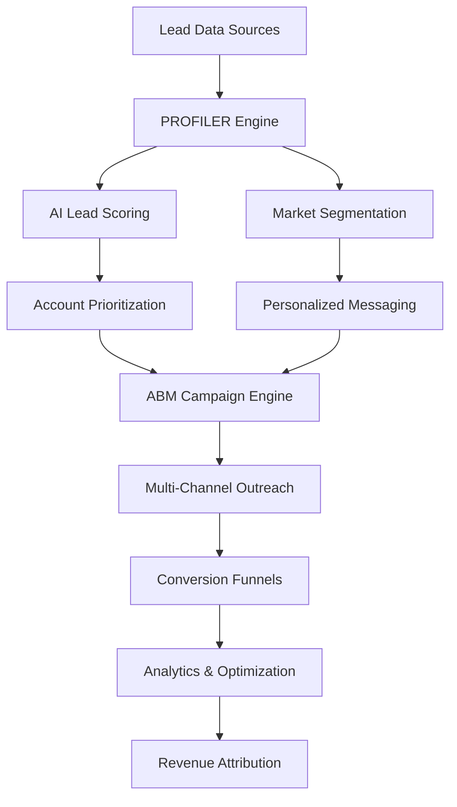

# 🎯 How To Implement PROFILER + LEAD RECON SYSTEM for Account-Based Marketing (ABM)

## Executive Summary

The PROFILER + LEAD RECON SYSTEM is an enterprise-grade, AI-powered lead intelligence automation platform specifically designed for Account-Based Marketing (ABM) strategies. This comprehensive guide will walk you through implementing this system into any business today, with a focus on maximizing ABM effectiveness.

## 🏗️ System Architecture Overview

### Core Components



### Key Features for ABM

- **🧠 AI-Powered Account Scoring**: GPT-4 driven analysis of account fit, intent, and engagement
- **📊 Intelligent Segmentation**: Dynamic account grouping based on industry, size, behavior, and potential
- **🎯 Personalized Content Generation**: AI-created messaging tailored to specific account characteristics
- **🤖 Multi-Channel Automation**: Automated outreach across email, LinkedIn, and other channels
- **📈 Real-Time Analytics**: Comprehensive tracking and optimization of ABM performance
- **🔄 Continuous Learning**: System improves over time through feedback loops and performance data

---

## 🚀 Phase 1: System Setup & Installation

### Prerequisites

**Node.js Requirements**: [[memory:9091581]]

- Node.js 22.12.0+ (required for all projects)
- pnpm 9.12.0+ for package management

### Installation Steps

1. **Clone and Setup**

```bash
# Clone the repository
git clone <repository-url>
cd PROFILER

# Verify Node.js version
node --version  # Must be v22.12.0 or higher

# Auto-setup Node.js 22 if needed
npm run setup

# Install dependencies
pnpm install
```

2. **Environment Configuration**

```bash
# Copy environment template
cp env.example .env

# Configure required environment variables
OPENAI_API_KEY=your_openai_api_key
LANGSMITH_API_KEY=your_langsmith_key
LANGSMITH_PROJECT=profiler-abm
STRIPE_SECRET_KEY=your_stripe_key
STRIPE_WEBHOOK_SECRET=your_webhook_secret
```

3. **Database Setup**

```bash
# Initialize database (if using external DB)
pnpm run db:migrate

# Seed with sample data
pnpm run seed
```

### Cloudflare Deployment [[memory:7722802]]

Since you prefer Cloudflare for deployment:

```bash
# Install Wrangler CLI
npm install -g wrangler

# Login to Cloudflare
wrangler login

# Deploy to Cloudflare Workers
pnpm run deploy:cloudflare
```

---

## 🎯 Phase 2: ABM Configuration & Account Setup

### 1. Define Your Ideal Customer Profile (ICP)

Configure the system with your ABM target accounts:

```typescript
// Example ABM Configuration
const abmConfig = {
  targetAccounts: {
    industries: ["SaaS", "E-commerce", "FinTech", "Healthcare"],
    companySizes: ["enterprise", "mid-market"],
    revenueRange: { min: 1000000, max: 100000000 },
    geographies: ["US", "UK", "CA", "AU"],
    technologyStack: ["Salesforce", "HubSpot", "Microsoft 365"],
  },
  accountScoring: {
    fitScore: 0.7, // Minimum fit score for targeting
    intentScore: 0.6, // Minimum intent score
    engagementScore: 0.5, // Minimum engagement threshold
    recencyWeight: 0.3, // Weight for recent activity
  },
};
```

### 2. Configure Data Sources

Set up integrations with your existing systems:

```typescript
// CRM Integration (HubSpot, Salesforce, Pipedrive)
const crmConfig = {
  type: "hubspot",
  apiKey: process.env.HUBSPOT_API_KEY,
  syncFrequency: "daily",
  fields: ["company", "industry", "revenue", "employees", "technology_stack"],
};

// Social Media Integration
const socialConfig = {
  linkedin: {
    apiKey: process.env.LINKEDIN_API_KEY,
    companyPages: ["your-company", "your-subsidiaries"],
    trackingEnabled: true,
  },
};

// Website Analytics
const analyticsConfig = {
  googleAnalytics: process.env.GA_PROPERTY_ID,
  mixpanel: process.env.MIXPANEL_TOKEN,
  customEvents: ["demo_request", "pricing_view", "whitepaper_download"],
};
```

---

## 🧠 Phase 3: AI Lead Scoring & Account Prioritization

### 1. Customize Lead Scoring Model

The system uses GPT-4 for intelligent lead scoring. Customize the scoring criteria:

```typescript
// lib/lead-scorer.ts - Customize scoring logic
export class ABMLeadScorer extends LeadScorer {
  protected calculateABMScore(lead: Lead): number {
    let score = 0.5; // Base score

    // Company size scoring (higher weight for ABM)
    if (lead.revenue > 50000000) score += 0.3; // Enterprise
    else if (lead.revenue > 10000000) score += 0.25; // Large Mid-market
    else if (lead.revenue > 1000000) score += 0.15; // Mid-market

    // Industry fit scoring
    const abmIndustries = ["SaaS", "E-commerce", "FinTech", "Healthcare"];
    if (abmIndustries.includes(lead.industry)) score += 0.2;

    // Technology stack alignment
    if (this.hasTargetTechStack(lead)) score += 0.15;

    // Engagement signals (recent activity, high engagement)
    score += lead.engagementScore * 0.2;

    // Geographic scoring
    const targetMarkets = ["US", "UK", "CA", "AU"];
    if (targetMarkets.includes(lead.location)) score += 0.1;

    return Math.min(1.0, Math.max(0.0, score));
  }
}
```

### 2. Account Segmentation Strategy

Configure segmentation for ABM campaigns:

```typescript
// lib/segmentation.ts - ABM-specific segments
export const abmSegments = [
  {
    name: "Enterprise Champions",
    criteria: {
      revenue: { min: 50000000 },
      employees: { min: 500 },
      score: { min: 0.8 },
    },
    priority: "high",
    channels: ["direct-sales", "executive-outreach", "linkedin"],
    conversionRate: 0.25,
  },
  {
    name: "Mid-Market Growth",
    criteria: {
      revenue: { min: 10000000, max: 50000000 },
      industry: ["SaaS", "E-commerce"],
      score: { min: 0.7 },
    },
    priority: "high",
    channels: ["email", "webinar", "content-marketing"],
    conversionRate: 0.18,
  },
  {
    name: "Strategic Accounts",
    criteria: {
      technologyStack: ["Salesforce", "HubSpot"],
      engagementScore: { min: 0.8 },
      score: { min: 0.75 },
    },
    priority: "high",
    channels: ["partnership", "referral", "linkedin"],
    conversionRate: 0.22,
  },
];
```

---

## 📊 Phase 4: Content Generation & Personalization

### 1. AI-Powered Content Creation

The system automatically generates personalized content for each account segment:

```typescript
// agents/profiler.ts - Personalized messaging generation
async function generateABMContent(
  segments: LeadSegment[],
  packet: any,
  llm: ChatOpenAI
) {
  const contentPrompt = PromptTemplate.fromTemplate(`
    Create personalized ABM messaging for {segmentName} accounts in the {industry} industry.

    Account Characteristics:
    {characteristics}

    Company Context:
    - Revenue: {revenue}
    - Employees: {employees}
    - Technology Stack: {techStack}
    - Recent Activity: {recentActivity}

    Generate:
    1. Executive-level email subject line
    2. Personalized opening hook
    3. Industry-specific value proposition
    4. ROI-focused call to action
    5. LinkedIn connection message
    6. Follow-up sequence (3 emails)

    Focus on business outcomes and strategic value for enterprise accounts.
  `);

  for (const segment of segments) {
    const personalizedContent = await llm.invoke(
      await contentPrompt.format({
        segmentName: segment.name,
        industry: packet.audience?.industry,
        characteristics: segment.characteristics.join(", "),
        revenue: segment.leads[0]?.revenue || "Not specified",
        employees: segment.leads[0]?.employees || "Not specified",
        techStack: segment.leads[0]?.technologyStack?.join(", ") || "Unknown",
        recentActivity: segment.leads[0]?.lastActivity || "Unknown",
      })
    );

    segment.personalizedMessaging = personalizedContent.content;
  }

  return segments;
}
```

### 2. Multi-Channel Content Adaptation

Content is automatically adapted for different channels:

- **Email**: Professional, ROI-focused, executive-level tone
- **LinkedIn**: Network-oriented, industry insights, thought leadership
- **Direct Mail**: High-touch, personalized, physical touchpoints
- **Webinar**: Educational, interactive, demonstration-focused

---

## 🤖 Phase 5: Automated Outreach & Campaign Management

### 1. Multi-Channel Outreach Configuration

```typescript
// agents/outreach.ts - ABM campaign automation
export async function createABMCampaigns(segments: LeadSegment[], packet: any) {
  const campaigns = [];

  for (const segment of segments) {
    const campaign = {
      segment: segment.name,
      priority: segment.priority,
      accounts: segment.leads.length,
      channels: segment.recommendedChannels,
      sequence: {
        day1: {
          email: generateExecutiveEmail(segment),
          linkedin: generateLinkedInConnection(segment),
        },
        day3: {
          email: generateFollowUpEmail(segment),
          directMail: generateDirectMailPackage(segment),
        },
        day7: {
          email: generateValueEmail(segment),
          linkedin: generateThoughtLeadershipPost(segment),
        },
        day14: {
          email: generateDemoInvitation(segment),
          phone: generateCallScript(segment),
        },
      },
    };

    campaigns.push(campaign);
  }

  return campaigns;
}
```

### 2. CRM Integration & Lead Management

```typescript
// lib/mcp-rube-integration.ts - CRM automation
export class ABMCRMIntegration {
  async syncAccountData(accounts: ScoredLead[]) {
    // Sync high-value accounts to CRM
    const highValueAccounts = accounts.filter((lead) => lead.score > 0.8);

    for (const account of highValueAccounts) {
      await this.createOrUpdateAccount(account);
      await this.createContactRecords(account);
      await this.setupABMPlaybook(account);
    }
  }

  async createABMPlaybook(account: ScoredLead) {
    const playbook = {
      accountId: account.id,
      priority: account.priority,
      owner: this.assignAccountOwner(account),
      sequence: this.generateAccountSequence(account),
      milestones: this.defineAccountMilestones(account),
    };

    return await this.crmClient.createPlaybook(playbook);
  }
}
```

---

## 📈 Phase 6: Conversion Optimization & Funnel Management

### 1. ABM-Optimized Landing Pages

```typescript
// agents/funnel.ts - ABM funnel strategy
async function generateABMFunnelStrategy(
  packet: any,
  artifacts: any,
  llm: ChatOpenAI
) {
  const strategyPrompt = PromptTemplate.fromTemplate(`
    Create an ABM-optimized funnel strategy for enterprise accounts in {industry}.

    Account Profile:
    - Company Size: {companySize}
    - Industry: {industry}
    - Technology Stack: {techStack}
    - Pain Points: {painPoints}

    Design a high-touch conversion funnel with:

    1. EXECUTIVE LANDING PAGE:
    - C-level focused messaging
    - ROI calculator and business case
    - Executive summary and case studies
    - Direct access to decision makers

    2. PERSONALIZED DEMO EXPERIENCE:
    - Account-specific use cases
    - Industry benchmarks and comparisons
    - Custom ROI projections
    - Implementation timeline

    3. ENTERPRISE SALES PROCESS:
    - Multi-stakeholder approval workflow
    - Security and compliance information
    - Integration requirements
    - Custom pricing and terms

    Focus on enterprise sales cycles and multi-touch decision making.
  `);

  const strategy = await llm.invoke(
    await strategyPrompt.format({
      industry: packet.audience?.industry,
      companySize: "Enterprise",
      techStack: artifacts.profiler?.segments?.[0]?.characteristics?.join(", "),
      painPoints: packet.audience?.painPoints?.join(", "),
    })
  );

  return parseABMStrategy(strategy.content as string);
}
```

### 2. Account-Specific Conversion Tactics

- **Executive Briefings**: C-level focused presentations
- **ROI Calculators**: Custom business case development
- **Proof of Concepts**: Hands-on product demonstrations
- **Reference Calls**: Customer success story sharing
- **Security Reviews**: Enterprise-grade compliance documentation

---

## 📊 Phase 7: Analytics, Measurement & Optimization

### 1. ABM-Specific KPIs

```typescript
// contracts/Analytics.ts - ABM metrics
export interface ABMAnalytics {
  accountMetrics: {
    totalTargetAccounts: number;
    accountsEngaged: number;
    accountsInPipeline: number;
    accountsClosed: number;
    averageDealSize: number;
    salesCycleLength: number;
  };

  engagementMetrics: {
    emailOpenRate: number;
    emailClickRate: number;
    linkedinConnectionRate: number;
    webinarAttendanceRate: number;
    demoRequestRate: number;
  };

  contentMetrics: {
    personalizedContentGenerated: number;
    contentEngagementBySegment: Record<string, number>;
    conversionByContentType: Record<string, number>;
  };

  revenueMetrics: {
    pipelineGenerated: number;
    dealsClosed: number;
    revenueAttributed: number;
    roi: number;
  };
}
```

### 2. Real-Time Performance Tracking

```typescript
// agents/analytics.ts - ABM analytics
export async function trackABMPerformance(packet: any, artifacts: any) {
  const analytics = {
    eventId: packet.eventId,
    timestamp: new Date().toISOString(),
    accountMetrics: {
      totalAccounts: artifacts.profiler?.totalLeads || 0,
      highValueAccounts: artifacts.profiler?.highValueLeads || 0,
      averageScore: artifacts.profiler?.averageScore || 0,
      segmentBreakdown: artifacts.profiler?.segments?.map((s) => ({
        name: s.name,
        count: s.size,
        priority: s.priority,
      })),
    },
    campaignMetrics: {
      campaignsGenerated: artifacts.outreach?.campaigns?.length || 0,
      emailsPrepared: artifacts.outreach?.totalEmails || 0,
      automationEnabled: artifacts.outreach?.automationEnabled || false,
    },
    funnelMetrics: {
      landingPageUrl: artifacts.funnel?.url,
      conversionStrategy: artifacts.funnel?.strategy,
      targetConversionRate:
        artifacts.funnel?.conversionElements?.targetConversionRate,
    },
  };

  // Log to LangSmith for observability
  await logWorkflowExecution(
    packet.eventId,
    "abm_analytics_tracking",
    analytics,
    { status: "completed" },
    Date.now() - analytics.timestamp,
    {
      accountCount: analytics.accountMetrics.totalAccounts,
      highValueCount: analytics.accountMetrics.highValueAccounts,
      campaignCount: analytics.campaignMetrics.campaignsGenerated,
    }
  );

  return analytics;
}
```

---

## 🎯 Phase 8: Advanced ABM Strategies & Best Practices

### 1. Account Scoring Optimization

**Continuous Learning Algorithm**:

```typescript
// lib/lead-scorer.ts - Adaptive scoring
export class AdaptiveABMScorer extends ABMLeadScorer {
  async updateScoringWeights(performanceData: ABMAnalytics) {
    // Adjust weights based on conversion performance
    const successfulAccounts = performanceData.accountMetrics.accountsClosed;
    const totalEngaged = performanceData.accountMetrics.accountsEngaged;

    const conversionRate = successfulAccounts / totalEngaged;

    if (conversionRate > 0.2) {
      // Increase weights for high-performing indicators
      this.adjustWeights({
        revenue: 1.1,
        industry: 1.05,
        engagement: 1.15,
      });
    } else {
      // Adjust for better targeting
      this.adjustWeights({
        revenue: 0.95,
        industry: 1.1,
        engagement: 0.9,
      });
    }
  }
}
```

### 2. Multi-Touch Attribution

```typescript
// lib/attribution.ts - ABM attribution model
export class ABMAttribution {
  calculateMultiTouchAttribution(touchpoints: Touchpoint[]) {
    const attribution = {
      firstTouch: 0.3,
      middleTouch: 0.4,
      lastTouch: 0.3,
    };

    return touchpoints.map((touchpoint, index) => ({
      ...touchpoint,
      attributionWeight: this.getAttributionWeight(index, touchpoints.length),
      contributionToConversion:
        touchpoint.conversionValue *
        attribution[
          index === 0
            ? "firstTouch"
            : index === touchpoints.length - 1
            ? "lastTouch"
            : "middleTouch"
        ],
    }));
  }
}
```

### 3. Account Expansion Strategies

```typescript
// lib/account-expansion.ts - Upsell and expansion
export class AccountExpansion {
  async identifyExpansionOpportunities(account: ScoredLead, usageData: any) {
    const opportunities = [];

    // Usage-based expansion
    if (usageData.monthlyActiveUsers > account.employees * 0.8) {
      opportunities.push({
        type: "seat_expansion",
        potential: "high",
        recommendation: "Add additional user licenses",
      });
    }

    // Feature-based expansion
    if (usageData.featureUtilization < 0.6) {
      opportunities.push({
        type: "feature_upgrade",
        potential: "medium",
        recommendation: "Introduce advanced features",
      });
    }

    return opportunities;
  }
}
```

---

## 🔧 Phase 9: Integration & Customization

### 1. CRM Integration Examples

**HubSpot Integration**:

```typescript
// lib/hubspot-integration.ts
export class HubSpotABMIntegration {
  async syncAccountData(accounts: ScoredLead[]) {
    for (const account of accounts) {
      await this.hubspotClient.companies.createOrUpdate({
        properties: {
          name: account.company,
          industry: account.industry,
          annualrevenue: account.revenue,
          numberofemployees: account.employees,
          abm_score: account.score,
          abm_segment: account.segment,
          abm_priority: account.priority,
        },
      });
    }
  }

  async createABMWorkflow(segment: LeadSegment) {
    const workflow = {
      name: `ABM Campaign - ${segment.name}`,
      type: "DRIP_DELAY",
      enabled: true,
      goals: [
        {
          goalType: "PROPERTY_VALUE",
          propertyName: "abm_engagement_score",
          operator: "GREATER_THAN",
          value: "0.7",
        },
      ],
      actions: this.generateSegmentActions(segment),
    };

    return await this.hubspotClient.workflows.create(workflow);
  }
}
```

**Salesforce Integration**:

```typescript
// lib/salesforce-integration.ts
export class SalesforceABMIntegration {
  async createAccountRecords(accounts: ScoredLead[]) {
    const records = accounts.map((account) => ({
      Name: account.company,
      Industry: account.industry,
      AnnualRevenue: account.revenue,
      NumberOfEmployees: account.employees,
      ABM_Score__c: account.score,
      ABM_Segment__c: account.segment,
      ABM_Priority__c: account.priority,
      RecordTypeId: this.getABMRecordTypeId(),
    }));

    return await this.salesforceClient.sobject("Account").create(records);
  }

  async setupABMCampaigns(segments: LeadSegment[]) {
    for (const segment of segments) {
      const campaign = {
        Name: `ABM - ${segment.name}`,
        Type: "Account-Based Marketing",
        Status: "Active",
        StartDate: new Date(),
        EndDate: new Date(Date.now() + 90 * 24 * 60 * 60 * 1000), // 90 days
        Description: `Automated ABM campaign for ${segment.name} segment`,
      };

      await this.salesforceClient.sobject("Campaign").create(campaign);
    }
  }
}
```

### 2. Marketing Automation Platform Integration

**Marketo Integration**:

```typescript
// lib/marketo-integration.ts
export class MarketoABMIntegration {
  async createABMPrograms(segments: LeadSegment[]) {
    for (const segment of segments) {
      const program = {
        name: `ABM Program - ${segment.name}`,
        type: "Email",
        channel: "Email",
        status: "Active",
        costs: [
          {
            costType: "Budget",
            amount: segment.leads.length * 50, // $50 per account
          },
        ],
      };

      const createdProgram = await this.marketoClient.programs.create(program);
      await this.setupProgramAssets(createdProgram, segment);
    }
  }

  async setupProgramAssets(program: any, segment: LeadSegment) {
    // Create email templates
    const emailTemplate = {
      name: `ABM Email - ${segment.name}`,
      subject:
        segment.personalizedMessaging?.subject || "Personalized ABM Message",
      content: segment.personalizedMessaging?.body || "Default ABM content",
    };

    await this.marketoClient.emailTemplates.create(emailTemplate);

    // Create landing pages
    const landingPage = {
      name: `ABM Landing - ${segment.name}`,
      url: `abm-${segment.name.toLowerCase().replace(/\s+/g, "-")}`,
      content: this.generateLandingPageContent(segment),
    };

    await this.marketoClient.landingPages.create(landingPage);
  }
}
```

---

## 📋 Phase 10: Monitoring, Maintenance & Scaling

### 1. Performance Monitoring Dashboard

```typescript
// lib/dashboard.ts - ABM performance dashboard
export class ABMDashboard {
  async generatePerformanceReport(timeframe: string = "30d") {
    const report = {
      timeframe,
      generatedAt: new Date().toISOString(),
      accountMetrics: {
        totalTargetAccounts: await this.getTotalTargetAccounts(),
        accountsEngaged: await this.getAccountsEngaged(timeframe),
        accountsInPipeline: await this.getAccountsInPipeline(),
        accountsClosed: await this.getAccountsClosed(timeframe),
        averageDealSize: await this.getAverageDealSize(timeframe),
        salesCycleLength: await this.getAverageSalesCycle(timeframe),
      },
      engagementMetrics: {
        emailOpenRate: await this.getEmailOpenRate(timeframe),
        emailClickRate: await this.getEmailClickRate(timeframe),
        linkedinConnectionRate: await this.getLinkedInConnectionRate(timeframe),
        demoRequestRate: await this.getDemoRequestRate(timeframe),
      },
      contentMetrics: {
        personalizedContentGenerated: await this.getContentGenerated(timeframe),
        contentEngagementBySegment: await this.getContentEngagementBySegment(
          timeframe
        ),
        conversionByContentType: await this.getConversionByContentType(
          timeframe
        ),
      },
      revenueMetrics: {
        pipelineGenerated: await this.getPipelineGenerated(timeframe),
        dealsClosed: await this.getDealsClosed(timeframe),
        revenueAttributed: await this.getRevenueAttributed(timeframe),
        roi: await this.getROI(timeframe),
      },
    };

    return report;
  }
}
```

### 2. Automated Optimization

```typescript
// lib/optimization.ts - Automated ABM optimization
export class ABMOptimization {
  async optimizeCampaigns(performanceData: ABMAnalytics) {
    const optimizations = [];

    // Email optimization
    if (performanceData.engagementMetrics.emailOpenRate < 0.2) {
      optimizations.push({
        type: "email_subject_optimization",
        recommendation: "A/B test more personalized subject lines",
        priority: "high",
      });
    }

    // Content optimization
    if (
      performanceData.contentMetrics.conversionByContentType["webinar"] > 0.15
    ) {
      optimizations.push({
        type: "content_strategy",
        recommendation:
          "Increase webinar production for high-converting segments",
        priority: "medium",
      });
    }

    // Targeting optimization
    if (
      performanceData.accountMetrics.accountsEngaged <
      performanceData.accountMetrics.totalTargetAccounts * 0.3
    ) {
      optimizations.push({
        type: "targeting_expansion",
        recommendation: "Expand target account list or adjust scoring criteria",
        priority: "high",
      });
    }

    return optimizations;
  }

  async autoImplementOptimizations(optimizations: Optimization[]) {
    for (const optimization of optimizations) {
      if (optimization.priority === "high") {
        await this.implementOptimization(optimization);
      }
    }
  }
}
```

---

## 🎯 Success Metrics & ROI Calculation

### Key Performance Indicators (KPIs)

1. **Account Engagement Rate**: Percentage of target accounts that engage with content
2. **Pipeline Velocity**: Speed at which accounts move through sales stages
3. **Deal Size**: Average contract value for ABM accounts
4. **Sales Cycle Length**: Time from first touch to closed deal
5. **Account Expansion**: Revenue growth from existing ABM accounts
6. **Content Performance**: Engagement rates by content type and segment

### ROI Calculation Formula

```typescript
// lib/roi-calculator.ts
export class ABMROICalculator {
  calculateROI(abmData: ABMAnalytics, costs: ABMCosts): ROIMetrics {
    const revenue = abmData.revenueMetrics.revenueAttributed;
    const totalCosts =
      costs.technology + costs.content + costs.advertising + costs.labor;

    const roi = ((revenue - totalCosts) / totalCosts) * 100;
    const paybackPeriod = totalCosts / (revenue / 12); // months

    return {
      roi,
      paybackPeriod,
      revenuePerAccount: revenue / abmData.accountMetrics.totalTargetAccounts,
      costPerAccount: totalCosts / abmData.accountMetrics.totalTargetAccounts,
      ltv: revenue * 3, // Assuming 3-year customer lifetime
      cac: totalCosts / abmData.accountMetrics.accountsClosed,
    };
  }
}
```

---

## 🚀 Getting Started Checklist

### Week 1: Foundation Setup

- [ ] Install and configure the PROFILER system
- [ ] Set up environment variables and API keys
- [ ] Configure initial ABM account lists
- [ ] Set up CRM integrations
- [ ] Define ICP and scoring criteria

### Week 2: Content & Personalization

- [ ] Generate initial personalized content
- [ ] Set up multi-channel messaging templates
- [ ] Configure account segmentation
- [ ] Create ABM landing pages
- [ ] Set up conversion tracking

### Week 3: Automation & Campaigns

- [ ] Launch first ABM campaigns
- [ ] Set up automated outreach sequences
- [ ] Configure lead nurturing workflows
- [ ] Implement account scoring automation
- [ ] Set up performance monitoring

### Week 4: Optimization & Scaling

- [ ] Analyze initial performance data
- [ ] Optimize campaigns based on results
- [ ] Expand to additional account segments
- [ ] Implement advanced attribution tracking
- [ ] Plan scaling strategy

---

## 💡 Best Practices & Pro Tips

### 1. Account Selection Strategy

- Focus on 50-100 high-value accounts initially
- Use firmographic and technographic data for targeting
- Prioritize accounts with existing technology stack alignment
- Consider intent data and engagement signals

### 2. Content Personalization

- Create industry-specific messaging and case studies
- Use account-specific pain points and challenges
- Include relevant social proof and testimonials
- Adapt content for different stakeholder personas

### 3. Multi-Channel Orchestration

- Coordinate touchpoints across email, LinkedIn, and direct mail
- Ensure consistent messaging across all channels
- Use account-level triggers for timely outreach
- Implement account-based advertising for awareness

### 4. Sales & Marketing Alignment

- Establish clear account ownership and handoff processes
- Share account insights and engagement data
- Coordinate multi-stakeholder outreach
- Align on success metrics and goals

### 5. Continuous Optimization

- Monitor performance metrics weekly
- A/B test messaging and content regularly
- Adjust targeting based on conversion data
- Scale successful campaigns and retire poor performers

---

## 🔗 Additional Resources

- **System Documentation**: `/docs/` directory for technical details
- **API Reference**: Available in the `/api/` directory
- **Integration Guides**: Specific setup guides for popular CRMs
- **Training Materials**: Video tutorials and best practice guides
- **Community Support**: Access to user community and expert advice

---

## 📞 Support & Next Steps

For implementation support, customization needs, or advanced ABM strategies:

1. **Technical Support**: Review the system documentation and troubleshooting guides
2. **Custom Development**: Contact for enterprise-level customizations
3. **Training & Onboarding**: Schedule personalized training sessions
4. **Strategy Consulting**: Get expert advice on ABM strategy optimization

The PROFILER + LEAD RECON SYSTEM is designed to scale with your business and continuously improve your ABM results. Start with the foundation, iterate based on performance data, and scale successful strategies across your entire target account portfolio.

---

_This implementation guide provides a comprehensive roadmap for deploying AI-powered ABM at scale. The system's modular architecture allows for customization and expansion as your ABM program matures and grows._
